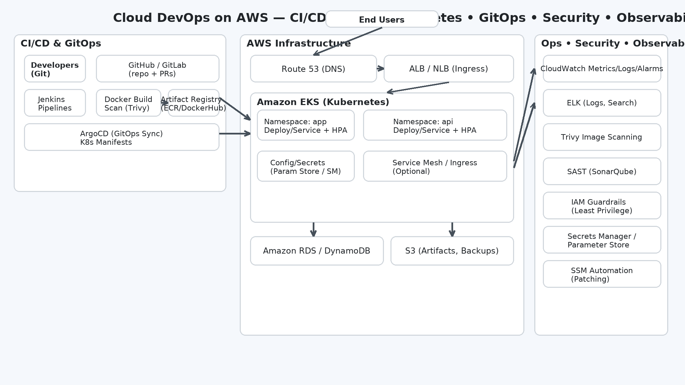

# 🌩️ Cloud DevOps Project (AWS | Terraform | Ansible | Docker | EKS | ArgoCD)


A production-style **DevOps reference implementation** on AWS. It provisions infrastructure with **Terraform**, configures with **Ansible**, builds and scans **Docker** images, deploys to **Amazon EKS** via **ArgoCD (GitOps)**, and wires **security + observability** end to end.

---

## 🏗️ Architecture


---

## 🚀 Quickstart

> Prereqs: AWS CLI, Terraform, kubectl, Docker, and (optional) Ansible installed; AWS credentials configured.

**Infra (Terraform)**
```bash
cd Terraform
terraform init
terraform fmt -check
terraform validate
terraform plan
terraform apply
```

**Config (Ansible)**
```bash
cd Ansible
ansible-playbook -i aws_ec2.yaml playbook.yaml
```

**App (Docker)**
```bash
cd Docker/App
docker build -t cloud-devops-app:latest .
docker run -p 5000:5000 cloud-devops-app:latest
```

**Deploy (Kubernetes/EKS + ArgoCD)**
```bash
kubectl apply -f Kubernetes/namespace.yaml
kubectl apply -f Kubernetes/deployment.yaml
kubectl apply -f Kubernetes/service.yaml
# or: kubectl apply -f ArgoCD/ (GitOps sync)
```

---

## 🔐 Security
- Image scanning with **Trivy**
- SAST with **SonarQube**
- IAM least-privilege, **Secrets Manager / Parameter Store**
- **SSM Automation** for patching

## 📈 Observability
- **CloudWatch** metrics, logs, alarms
- **ELK** for centralized logging

---

## 📦 Makefile Targets
```bash
make infra-validate   # terraform fmt/validate
make infra-apply      # terraform apply
make docker-build     # build app image
make docker-run       # run app locally
make k8s-apply        # apply Kubernetes manifests
```
(See `Makefile` for more)

---

## 🧪 CI (GitHub Actions)
- Terraform fmt + validate
- Docker build (lint coming soon)
- Kubernetes manifest validation

---

## 📝 License
MIT
